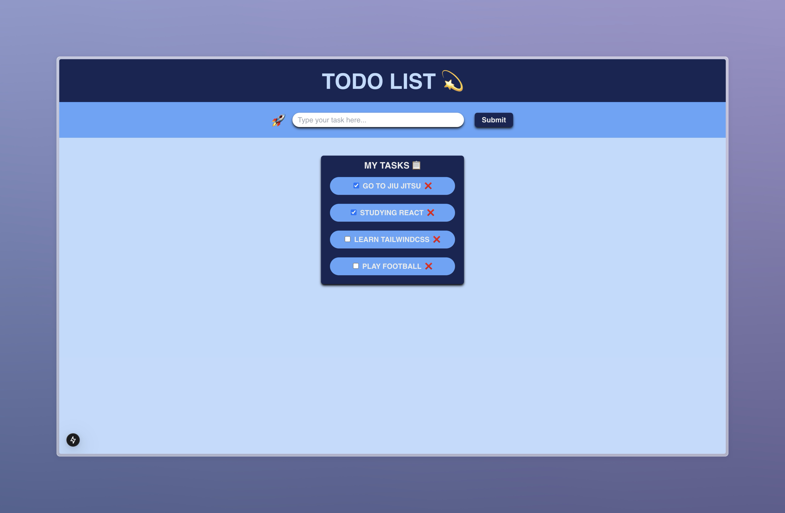

# React To-Do List 🚀

A simple and user-friendly To-Do List application built with React, TypeScript and TailwindCss. This app allows you to manage your tasks efficiently by adding, marking as complete, and deleting tasks.

---

## ✨ Features
- **Add Tasks**: Quickly add tasks with a clean and intuitive input field.
- **Mark Tasks as Complete**: Toggle tasks as completed using checkboxes.
- **Delete Tasks**: Remove tasks that are no longer needed.
- **Responsive Design**: Optimized for various screen sizes.

---

## 🖼️ Demo
  
*A screenshot of the application in action.*

---

## ⚙️ Installation

1. **Clone the repository:**
   ```bash
   git clone https://github.com/yourusername/react-todo-list.git
   cd react-todo-list
   npm install
   npm run dev
   http://localhost:3000

## 📋 Usage
- **Add a Task**: Type your task in the input field and click the "Submit" button.
- **Mark a Task as Complete**: Check the box next to the task.
- **Delete a Task**: Click the ❌ button next to the task.

## 🗂️ Code Structure
- **App.tsx**: The main component containing the logic and layout for the To-Do List.
- **Header.tsx**: A reusable header component.
- **types/items.ts**: Defines the Item type for TypeScript type checking.

## 🛠️ Technologies Used
- **React**
- **TypeScript**
- **Tailwind CSS**

## 👤 Author
- **Developed by Enzo Santos**.

   
